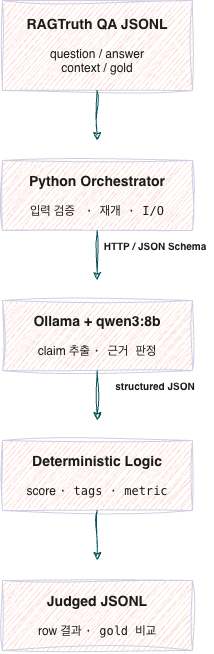

# 로컬 LLM 기반 RAG Faithfulness Judge

RAGAS의 faithfulness 평가 방식을 참고하여, RAGTruth QA 데이터에서 답변이 주어진 문맥에 충실한지(faithfulness)를 평가하는 프로젝트이다. RAGAS나 DeepEval 패키지, OpenAI API는 사용하지 않으며 Ollama에서 실행되는 오픈소스 모델 `qwen3:8b`를 judge로 사용한다.


## 1. 서론

### 1.1 목적

RAG 시스템은 검색된 문맥을 언어 모델에 제공해 답변을 생성하지만, 답변이 문맥에 없는 내용을 추가하거나 문맥과 충돌할 수 있다. 따라서 본 프로젝트의 목적은 다음과 같다.

- 답변을 검증 가능한 최소 claim으로 분해한다.
- 각 claim이 제공된 context에서 직접 추론 가능한지 판정한다.
- claim 비율로 faithfulness 점수를 계산한다.
- RAGTruth의 사람 주석(`gold_has_hallucination`)과 비교해 judge의 환각 탐지 성능을 측정한다.

### 1.2 참고 논문

#### RAGAS

[RAGAS: Automated Evaluation of Retrieval Augmented Generation](https://aclanthology.org/2024.eacl-demo.16/)은 정답 문장이 없어도 RAG 파이프라인을 평가하기 위한 프레임워크다. 논문은 다음 세 관점을 중심으로 RAG를 평가한다.

- **Faithfulness**: 답변의 claim이 검색 문맥에서 추론 가능한가?
- **Answer relevance**: 답변이 질문과 관련성이 있는가?
- **Context relevance**: 검색 문맥이 질문에 필요한 정보에 집중되어 있는가?

본 프로젝트는 그중 faithfulness를 구현했다. 답변을 claim으로 분해하고 각 claim의 문맥 지원 여부를 판정한 뒤, 지원된 claim의 비율을 점수로 사용한다.

RAGAS 논문의 faithfulness `0.95`는 WikiEval에서 인간의 두 답변 선호와 일치한 **pairwise accuracy**다. 본 프로젝트의 RAGTruth response-level F1과는 데이터, 과제와 지표가 다르므로 직접 비교하지 않는다.

- 논문: <https://aclanthology.org/2024.eacl-demo.16/>
- GitHub: <https://github.com/explodinggradients/ragas>

#### RAGTruth

[RAGTruth: A Hallucination Corpus for Developing Trustworthy Retrieval-Augmented Language Models](https://aclanthology.org/2024.acl-long.585/)은 QA, 요약, data-to-text 작업에서 생성된 약 18,000개 RAG 응답에 response-level 및 span-level 환각 주석을 제공한다.

본 프로젝트는 RAGTruth에서 다음 조건으로 QA 200건을 구성했다.

- 작업 유형: `QA`
- split: `test`
- quality: `good`
- 환각 있음: 100건
- 환각 없음: 100건
- seed: `42`

균형 표본은 결과 해석을 단순하게하지만, 원 논문의 무작위 QA test 150건과 동일한 평가셋은 아니다.

- 논문: <https://aclanthology.org/2024.acl-long.585/>
- GitHub: <https://github.com/ParticleMedia/RAGTruth>

## 2. 본론

### 2.1 프로젝트 구성

```text
.
├── faithfulness_judge.py       # 데이터 준비, 로컬 judge, 점수 계산과 결과 집계
├── ragtruth_qa.jsonl           # RAGTruth QA 200건
├── ragtruth_qa_judged.jsonl    # 평가가 완료된 200건 결과
└── README.md
```

평가 도중에는 `ragtruth_qa_judged.jsonl.partial`이 체크포인트로 생성된다. 실행이 중단되면 완료된 행 다음부터 재개하고, 200건이 모두 끝나면 최종 출력 파일로 이름을 변경한다.

### 2.2 실행 환경

- Python 3
- Ollama 0.34.2 이상
- 기본 judge 모델: `qwen3:8b`
- Python 외부 패키지 없음

```bash
brew install ollama
brew services start ollama
ollama pull qwen3:8b
```

```bash
OLLAMA_MODEL=qwen3:8b \
OLLAMA_URL=http://localhost:11434 \
python3 faithfulness_judge.py
```

### 2.3 입력 데이터

각 JSONL 행의 필수 필드는 다음과 같다.

| 필드 | 자료형 | 설명 |
|---|---|---|
| `question` | `str` | 사용자 질문 |
| `answer` | `str` | faithfulness를 평가할 답변 |
| `contexts` | `str` 또는 `list[str]` | 답변에 제공된 근거 문맥 |

RAGTruth 표본에서의 다음 정답 및 출처 필드

- `gold_has_hallucination`
- `gold_hallucination_labels`
- `ragtruth_response_id`
- `ragtruth_source_id`
- `ragtruth_model`
- `ragtruth_task_type`
- `ragtruth_split`
- `ragtruth_quality`

### 2.4 메트릭

#### Faithfulness score

답변에서 추출한 claim 중 context가 지원하는 claim의 비율이다.

```text
faithfulness_score = supported claim 수 / 전체 claim 수
```

예를 들어 전체 claim이 4개이고 3개가 지원되면 점수는 `0.75`다. 추출된 claim이 없으면 점수는 `null`이다.

#### 실패 태그

| 태그 | 조건 | 의미 |
|---|---|---|
| `retrieval_failure` | `context_sufficient == false` | 주어진 context만으로 질문에 답하기 어려움 |
| `generation_hallucination` | 하나 이상의 claim이 unsupported | 답변에 context가 지원하지 않는 내용이 있음 |
| `context_ignore` | context는 충분하지만 답변이 근거를 사용하지 않음 | 생성 모델이 제공된 근거를 무시함 |

#### Response-level 환각 탐지 성능

예측값: `generation_hallucination`in `failure_tags`<br> 정답: `gold_has_hallucination`

최종적으로 TP, FP, TN, FN과 다음 지표를 계산한다.

```text
accuracy  = (TP + TN) / 전체 데이터
precision = TP / (TP + FP)
recall    = TP / (TP + FN)
F1        = 2 × precision × recall / (precision + recall)
```
precision: True라고 생각한 것 중에 정답이 True인 것
recall: 실제 True 인 것 중에 정답이 True인 것

### 2.5 워크플로우

```text
ragtruth_qa.jsonl
        │
        ▼
evaluate_jsonl()
        │  한 행씩 읽고 체크포인트 저장
        ▼
evaluate_case()
        │
        ├─ 입력 필드 검증
        │
        ├─ extract_claims()
        │    └─ qwen3:8b 호출 1: 답변을 최소 claim으로 분해
        │
        ├─ judge_claims()
        │    └─ qwen3:8b 호출 2: context의 claim 지원 여부 판정
        │
        ├─ attach_claim_text()
        │    └─ claim_id로 원문 claim과 판정 결과 결합
        │
        └─ score_and_tags()
             └─ 점수와 실패 태그 계산
        │
        ▼
ragtruth_qa_judged.jsonl
        │
        ▼
gold_metrics()
        └─ RAGTruth 정답과 비교해 confusion matrix와 평가 지표 출력
```

### 2.6 아키텍처


- Ollama 요청은 JSON Schema structured output
- `temperature=0`
- thinking 비활성화
- judge가 claim 문장을 변경하거나 재정렬하는 문제를 막기 위해 문장 전체가 아닌 `claim_id`를 반환
- Python이 ID를 기준으로 원문 claim을 다시 결합

### 2.7 주요 함수

| 함수 | 역할 |
|---|---|
| `ask_json()` | Ollama에 요청하고 JSON Schema 형식의 응답을 파싱 |
| `extract_claims()` | 답변을 최소 단위의 factual claim으로 분해 |
| `judge_claims()` | 각 claim의 context 지원 여부와 문맥 충분성을 판정 |
| `attach_claim_text()` | 순서와 무관하게 `claim_id`로 원문 claim을 복원 |
| `score_and_tags()` | faithfulness 점수와 실패 태그를 결정적으로 계산 |
| `evaluate_case()` | 데이터 한 행의 전체 평가를 조정 |
| `evaluate_jsonl()` | JSONL 전체 평가, 체크포인트 저장과 재개를 담당 |
| `prepare_ragtruth()` | RAGTruth 원본에서 균형 QA 표본을 생성 |
| `gold_metrics()` | judge 예측과 RAGTruth 정답을 비교 |
| `self_check()` | LLM 호출 없이 핵심 Python 로직을 검사 |

### 2.8 실행 방법

자체 점검:

```bash
python3 faithfulness_judge.py --self-check
```

기본 평가:

```bash
python3 faithfulness_judge.py
```

다른 입출력 경로 사용:

```bash
python3 faithfulness_judge.py input.jsonl output.jsonl
```

RAGTruth 원본에서 표본 생성:

```bash
python3 faithfulness_judge.py \
  --prepare-ragtruth source_info.jsonl response.jsonl ragtruth_qa.jsonl \
  --sample-size 200 \
  --seed 42
```

실행 중 진행 상황 확인:

```bash
wc -l ragtruth_qa_judged.jsonl.partial
tail -n 1 ragtruth_qa_judged.jsonl.partial | python3 -m json.tool
```

### 2.9 출력 필드

| 필드 | 설명 |
|---|---|
| `faithfulness_score` | 지원된 claim의 비율 |
| `faithfulness_claims` | claim, 지원 여부와 판정 이유 |
| `context_sufficient` | context만으로 질문에 답할 수 있는지 여부 |
| `context_sufficiency_reason` | 문맥 충분성 판정 이유 |
| `answer_uses_available_evidence` | 답변이 제공된 근거를 사용했는지 여부 |
| `context_use_reason` | 근거 사용 판정 이유 |
| `failure_tags` | retrieval, generation, context-ignore 진단 태그 |
| `judge_model` | 평가에 사용한 모델 |

## 3. 결론

### 3.1 결과

RAGTruth QA 200건에 대한 qwen3:8b judge 결과는 다음과 같다.

| 지표 | 결과 |
|---|---:|
| TP | 24 |
| FP | 3 |
| TN | 97 |
| FN | 76 |
| Accuracy | 0.605 |
| Precision | 0.889 |
| Recall | 0.240 |
| F1 | 0.378 |

judge가 환각이라고 판정한 27건 중 24건은 실제 환각이어서 precision은 높았다. 반면 실제 환각 100건 중 76건을 놓쳐 recall은 낮았다. 즉 현재 judge는 오탐을 피하는 대신 미탐이 많은 평가기였다.

RAGTruth 논문의 QA response-level 기준선과 비교하면 이번 F1 `0.378`은 GPT-3.5 prompt `0.308` 및 LMvLM GPT-4 `0.301`보다 높고, SelfCheckGPT `0.437`, GPT-4 prompt `0.456`, fine-tuned Llama-2-13B `0.682`보다 낮다. 단, 논문은 무작위 QA test 150건을 사용했고 본 프로젝트는 균형 표본 200건을 사용했으므로 직접적인 순위 비교가 아니라 대략적인 위치만 의미한다.

또한 균형 데이터에서는 모든 응답을 환각이라고 예측하는 단순 분류기도 F1 `0.667`을 얻을 수 있다. 따라서 F1 하나만으로 시스템을 평가하지 않고 precision, recall, specificity와 실제 오류 비용을 함께 봐야 한다.

### 3.2 한계점

#### Judge 모델 의존성

faithfulness 판정은 qwen3:8b의 claim 추출 및 entailment 능력에 의존한다. `temperature=0`과 JSON Schema는 출력 형식을 안정화하지만 판정의 정확성을 보장하지 않는다. `reason` 역시 같은 모델이 생성하므로 독립적인 정답이 아니다.

#### 높은 precision과 낮은 recall

FN 76건 모두 judge가 `context_sufficient=true`, `answer_uses_available_evidence=true`로 판단했다. FN의 gold span에는 `Evident Baseless Info`가 74개, `Subtle Baseless Info`가 24개, `Evident Conflict`가 19개 포함되어 있었다. 명백한 근거 없음과 충돌도 다수 놓쳤으므로 현재 모델과 프롬프트의 근거 판정 능력이 충분하지 않다.

FN의 gold span 117개 중 84개는 추출 claim과 내용 단어가 50% 이상 겹쳤다. 이는 휴리스틱 분석이지만, claim 추출 누락보다 추출된 claim을 supported라고 잘못 판정하는 문제가 더 클 가능성을 보여준다.

#### 데이터와 비교 범위

- 200건의 사용자 정의 균형 표본이므로 RAGTruth 공식 150건 QA test 결과와 완전히 동일하지 않다.
- 결과를 확인한 test 데이터에 맞춰 프롬프트를 조정하면 test leakage가 발생한다.
- response-level F1은 환각 위치와 심각도를 반영하지 않는다.
- 단일 모델과 단일 실행 결과이므로 모델 크기와 반복 실행에 따른 변동을 비교하지 않았다.
- 체크포인트 재개는 입력 JSONL의 행 순서가 바뀌지 않는다고 가정한다.

### 3.3 개선사항

1. **Train/dev/test 분리**  
   RAGTruth train 또는 별도 dev 데이터에서 프롬프트와 모델을 선택하고, 최종 test는 한 번만 평가한다.

2. **FN 오류 유형 수동 분석**  
   FN을 claim 추출 누락, entailment 오판, 정답 정의 차이로 분류해 가장 큰 오류 원인을 먼저 개선한다.

3. **근거 판정 강화**  
   “직접 명시되거나 필연적으로 추론되는 내용만 supported”라는 기준을 강화하고, 약한 암시나 모델의 배경지식 사용을 금지한다.

4. **Claim별 독립 판정**  
   여러 claim을 한 번에 판정하는 대신 claim별 호출이나 배치 판정을 비교한다. 비용은 증가하지만 긴 context에서 claim 간 간섭을 줄일 수 있다.

5. **Judge 모델 비교**  
   동일한 200건에서 qwen3:8b와 더 큰 오픈소스 모델 또는 NLI 기반 모델을 비교한다. 모델별 precision-recall trade-off를 확인한다.

6. **다중 판정과 불확실성 처리**  
   여러 번 판정하거나 서로 다른 judge의 합의를 사용하고, 불확실한 사례는 사람 검토 대상으로 분리한다.

7. **검색 평가 추가**  
   gold relevant documents가 있는 데이터셋을 사용해 retrieval recall@k를 먼저 측정한 뒤, context가 충분한 사례에서 generation faithfulness를 별도로 평가한다.

8. **Span-level 평가 추가**  
   RAGTruth의 `start`, `end` 주석을 활용해 response-level F1뿐 아니라 환각 위치 탐지 성능도 측정한다.

## 참고 자료

- [RAGAS 논문](https://aclanthology.org/2024.eacl-demo.16/)
- [RAGAS GitHub](https://github.com/explodinggradients/ragas)
- [RAGTruth 논문](https://aclanthology.org/2024.acl-long.585/)
- [RAGTruth GitHub](https://github.com/ParticleMedia/RAGTruth)
- [Ollama Structured Outputs](https://docs.ollama.com/capabilities/structured-outputs)
- [Ollama qwen3:8b](https://ollama.com/library/qwen3:8b)
